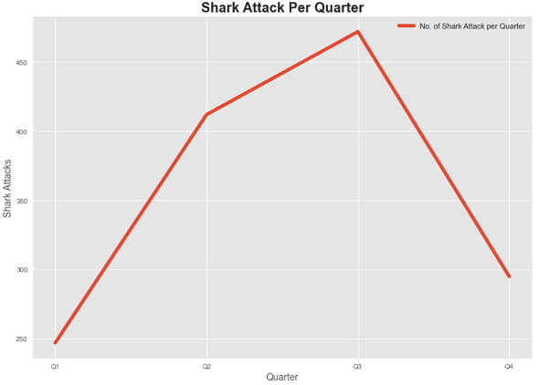
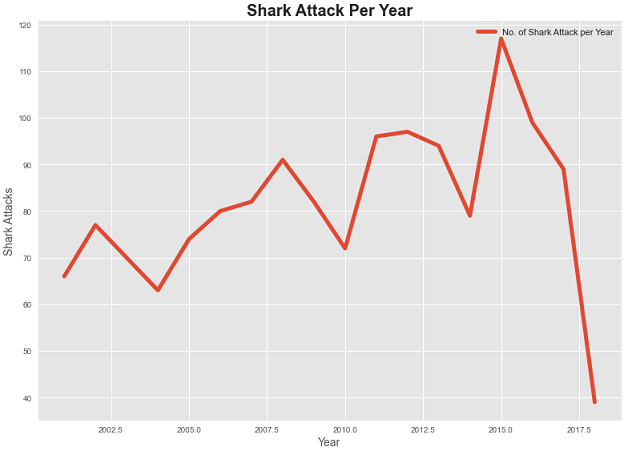
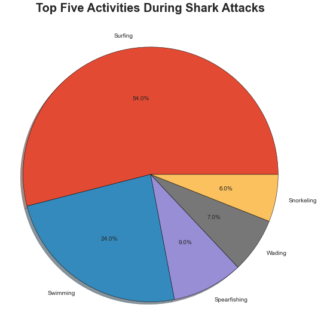
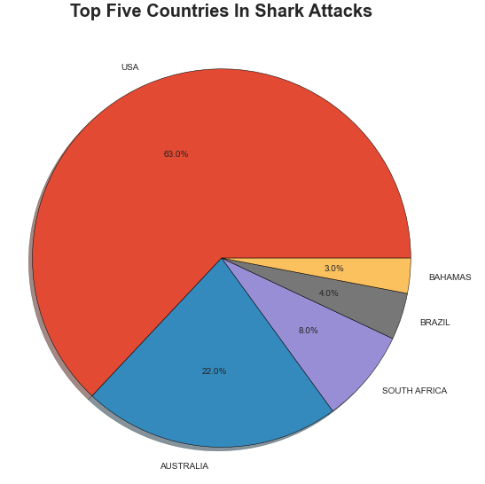
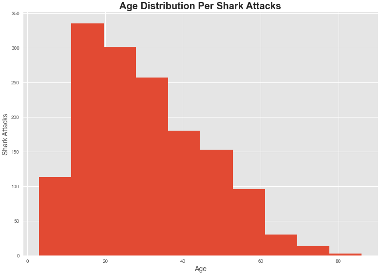

# Shark Attack Project

Data cleaning project to analyze the shark attacks through the time and propose a business idea based in the analysis.

## Description

Below are some of the concepts used to work in this particularly project:

* Find null values
* Columns manipulation
* Apply of basic statistics in the data
* Graph creation
* Data type fix
* Python basics (for loops, conditionals, lambda, functions)

## Libraries Used

It was used external libraries in order to do the data manipulation, and further analysis. 

Below are the list of libraries used:

* Pandas
* Numpy
* Regex
* Matplotlib

## Visuals

Graphs generated to conduct the data analysis

## Documents Generated

1. main.ipynb (main python notebook containing all the data manipulation to conduct the analysis)
2. db2.csv (updated csv file with the database manipulated(cleaning, analysis, etc.))
3. readme

## Authors and acknowledgement

This document was prepared by Diego Makishi Dias

I want to give a special thanks to my colleagues and teaching staff of the Data Analysis Full Time 43 of Iron Hack which provided me with all the knowledge and support to have done this work so far